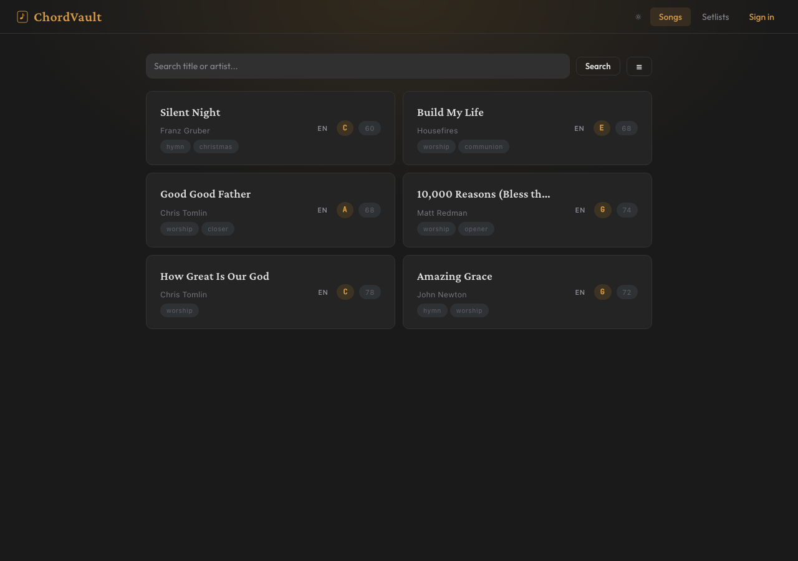
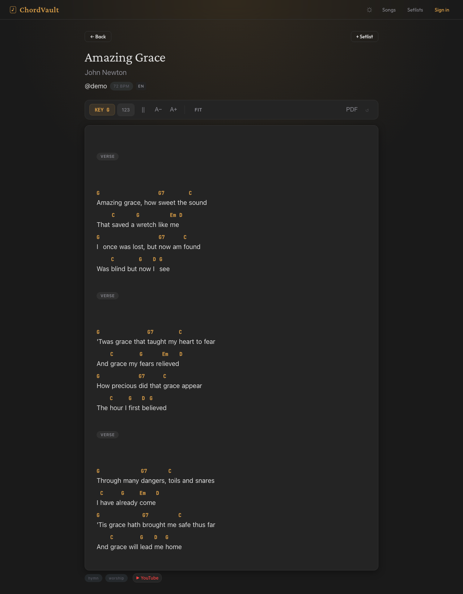
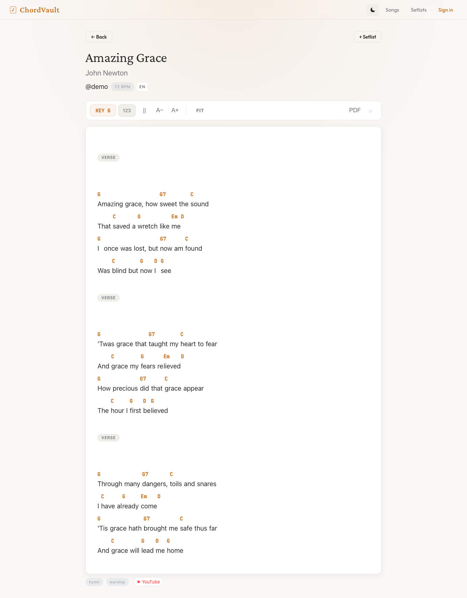
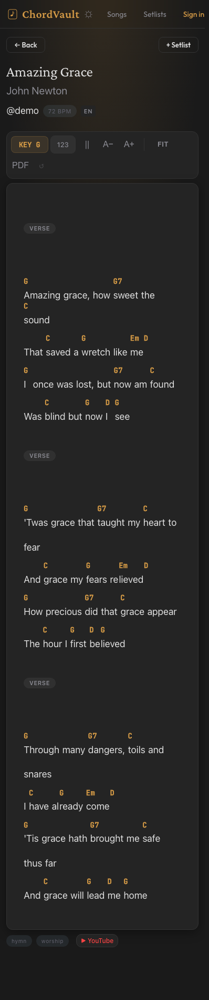

<p align="center">
  
</p>

<h1 align="center">ChordVault</h1>

<p align="center">A self-hosted chord sheet web app for musicians.</p> Store, transpose, and perform your chord sheets from any device on your local network.

   

**[Try the live demo](https://demochordvault.rudysam.com)** — login as `demo` / `demopass123` (resets every 6 hours)

## Why ChordVault?

**For self-hosters.** Ridiculously lightweight.
- Your entire library lives in a single SQLite file. No database server, no config, just one file you can back up or move.
- Chord parsing, transposition, and Nashville numbers all run in the browser via ChordSheetJS. The server just does light reads and writes.
- Zero background workers, minimal CPU and RAM. Runs happily on a Raspberry Pi, an old laptop, or whatever you have lying around.
- One Docker command to deploy. Your data stays on your hardware.

**For worship leaders & admins.** Keep your team organized.
- Invite-only registration with one-time codes. No open signups, no strangers.
- Tag songs (worship, praise, hymn, opener, closer, communion...) and track BPM to build balanced setlists fast.
- Community corrections let anyone fix wrong chords. You review and approve before anything changes.
- Admin dashboard to manage users, review corrections, and keep the library clean.
- Role system (owner/admin/user) gives you control without micromanaging.

**For musicians.** Paste chords and start playing.
- Accepts any format: ChordPro, chords-over-lyrics, Ultimate Guitar. Auto-detected and converted.
- Transpose on the fly, switch to Nashville numbers, link YouTube videos for reference.
- Swipe through setlists during rehearsal with one hand. Side taps, swipe gestures, or arrow keys.
- Adjust font size, hide distractions, go fullscreen. Whatever helps you focus on the music.



<details>
<summary>More screenshots</summary>

| Song view (dark) | Song view (light) | Mobile |
|---|---|---|
|  |  |  |

</details>

## Features

### Songs & Chords
- **Rich chord editor:** CodeMirror 6 with ChordPro syntax highlighting (chords, sections, and directives each colored distinctly) + live preview side-by-side on desktop, tabbed on mobile
- **Multi-format input:** paste ChordPro, chords-over-lyrics, or Ultimate Guitar. Auto-detected on save.
- **OCR (image/PDF → chord sheet):** snap a photo, pick an image, or upload a PDF — extract text with Gemini Flash, review the result, then use conversational refinement to fix any mistakes before saving (e.g. "move the G chord to the next word", "verse 2 should be Am not Em"). Works with CJK languages (Chinese, Japanese, Korean) and other non-Latin scripts.
- **Key picker:** tap the current key to see all 12 keys, tap any key to transpose instantly
- **Number notation:** toggle to convert chords to numbers (1, 4, 5) — key-agnostic
- **Song versioning:** multiple arrangements per song, each optionally linked to a YouTube video
- **YouTube link:** attach a YouTube URL to any song or version, opens in a new tab
- **BPM & tags:** track tempo and categorize with preset tags (worship, praise, hymn, opener, closer, etc.)
- **Song language:** required on every song, searchable ISO 639-1 dropdown with preferred languages pinned at top. Filter songs by language on the browse page.
- **Public/private songs:** toggle visibility per song — private songs are only visible to you and admins
- **Browse without an account:** all public songs and public setlists are readable by anyone

### Setlists & Display
- **Build setlists:** ordered song lists with per-song key, number notation, and display overrides
- **Local browser setlists:** no account needed, stored in your browser
- **Swipe playback:** swipe, tap side buttons, or use keyboard to navigate between songs
- **PDF export:** export a single song or an entire setlist as PDF. Auto-fits to one page per song using 2-column layout when needed. Theme-aware background.
- **Settings panel:** global defaults (number notation, hide YouTube, multi-column, font size) with per-song overrides
- **Multi-column layout:** split long chord sheets into columns for landscape or wide screens
- **Font size A-/A+:** adjustable font scale with reset — great for tablets on a music stand
- **Inline editing:** fix chords mid-session, save to the entry or as a new version

### Admin & Team
- **Invite-only registration:** generate one-time codes, no open signups
- **Community corrections:** anyone can submit fixes, owners and admins review
- **Role system:** owner / admin / user with scoped permissions
- **Admin panel:** manage users, review corrections, bulk import (up to 500 songs)

## Technical
- **React + TypeScript frontend:** built with Vite, ESLint + Prettier enforced
- **CodeMirror 6 editor:** ChordPro syntax highlighting, bracket matching, dark/light theme, live preview pane
- **Single-file database:** SQLite with WAL mode, no external DB server
- **CI/CD:** GitHub Actions runs lint, typecheck, build, and smoke test on every push/PR
- **Lightweight:** minimal CPU/RAM, runs on a Raspberry Pi

## Quick Start

### Docker (recommended)

1. Create a `docker-compose.yml`:

```yaml
services:
  chordvault:
    image: ghcr.io/rusahu/chordvault:latest
    container_name: chordvault
    ports:
      - "3100:3100"
    volumes:
      - ./data:/app/data
    environment:
      - JWT_SECRET=change-me-to-a-random-string
    restart: unless-stopped
```

2. Start it:

```bash
docker compose up -d
```

Open `http://localhost:3100` and register your first account.

Your database lives in `./data/chordvault.db`. Back up this directory to preserve your library.

To update:

```bash
docker compose pull
docker compose up -d
```

### Build from source (Docker)

```bash
git clone https://github.com/rusahu/chordvault.git
cd chordvault
cp .env.example .env
# Edit .env and set a strong JWT_SECRET
docker compose up -d
```

### Build from source

```bash
git clone https://github.com/rusahu/chordvault.git
cd chordvault
npm install
cd frontend && npm install && npm run build && cd ..
cp .env.example .env
# Edit .env and set a strong JWT_SECRET
node server.js
```

> **Note:** `better-sqlite3` requires build tools (`python3`, `make`, `g++`). On macOS these come with Xcode CLI tools. On Ubuntu: `sudo apt install python3 make g++`.

### Development

```bash
npm run dev   # Starts backend + Vite dev server with hot reload
```

**Run checks:**

```bash
npm run lint                 # Lint backend
cd frontend && npm run lint  # Lint frontend
cd frontend && npm run test  # Run frontend unit tests (Vitest)
npm run format               # Format backend with Prettier
cd frontend && npm run build # Build frontend
node test/smoke.js           # Playwright smoke test (requires running server)
```

A pre-commit hook (via Husky) automatically runs lint on staged files, TypeScript typecheck, and frontend unit tests before every commit.

## Configuration

| Variable | Default | Description |
|----------|---------|-------------|
| `JWT_SECRET` | *(required)* | Secret key for signing auth tokens. **Must be set.** |
| `PORT` | `3100` | Port the server listens on |
| `TURNSTILE_SITE_KEY` | *(optional)* | Cloudflare Turnstile site key — enables bot protection on registration and invite redemption |
| `TURNSTILE_SECRET_KEY` | *(optional)* | Cloudflare Turnstile secret key (pair with `TURNSTILE_SITE_KEY`) |

> **Registration** is disabled by default on fresh installs. The first user to register becomes the owner. After that, the owner enables registration from the admin panel or generates invite codes.

> **Gemini API key** for Smart OCR is configured per-user in Settings (not an env var). Keys are stored AES-256-GCM encrypted, derived from `JWT_SECRET`. Users can also customize the OCR prompt from Settings.

## Reverse Proxy

If you're running this behind a reverse proxy (Caddy, Nginx, Traefik), point your subdomain to port 3100. Example Caddy config:

```
chords.example.com {
  reverse_proxy localhost:3100
}
```

## Project Structure

```
server.js       Express entrypoint
lib/            Backend modules (db, auth, validation, constants, errors)
routes/         API route handlers
frontend/       React + TypeScript SPA (Vite)
public/         Built frontend assets
test/           Smoke test (Playwright)
scripts/        Dev tooling (seed data, screenshots)
docs/           Contributor guide, screenshots
```

## Reference

<details>
<summary><strong>Usage Guide</strong></summary>

### Getting Started
1. **Browse without an account** all songs and public setlists are accessible immediately. You can also build local setlists stored in your browser.
2. **Register** from the login screen (or use an invite code if registration is closed) to create and edit songs, submit corrections, and create server-synced setlists.
3. **Add a song** click **+ New Song**, paste lyrics in any supported format, and save

### Viewing Songs
1. Open any song to see rendered chords. Tap the key (e.g. "G") to expand a picker with all 12 keys — tap any to transpose instantly.
2. Toggle **123** to convert chords to numbers (1, 4, 5). Toggle **||** for multi-column layout. Use **A-/A+** to adjust font size. **Fit** auto-sizes font and columns for your screen.
3. Add a YouTube URL when editing a song. A link appears in the song view metadata row.

### Setlists
1. Go to **Setlists** tab, create a setlist, and add songs from your library.
2. Click a song entry to jump to it in playback. Reorder with up/down arrows.
3. Hit **Open** and swipe left/right (or use arrow keys) to navigate between songs.
4. The **settings panel** (⚙) sets global defaults: number notation, hide YouTube, multi-column, font size.
5. The **per-song toolbar** lets you override key, number, columns, and font for individual songs (dot indicator shows overrides).

</details>

<details>
<summary><strong>Supported Formats</strong></summary>

Songs are stored internally as [ChordPro](https://www.chordpro.org/), but you can paste any of these formats and they'll be auto-detected and converted:

**ChordPro:**
```
{title: Let It Be}
{key: C}
[C]When I find myself in [G]times of trouble
```

**Chords Over Lyrics:**
```
C                G
When I find myself in times of trouble
```

**Ultimate Guitar:**
```
[Verse]
C                G
When I find myself in times of trouble
```

**Image or PDF (via OCR):** Use the "Import from image or PDF" button in the song editor to extract text from a photo or PDF of a chord sheet. After extraction, use the built-in chat to refine the result — describe what's wrong and Gemini will fix it. Requires a Gemini Flash API key (configured in Settings). Max file size: 18MB.

A live format badge in the editor shows which format was detected. The editor itself is CodeMirror 6 with ChordPro syntax highlighting — the right pane shows a live rendered preview that updates as you type.

</details>

<details>
<summary><strong>Keyboard Shortcuts</strong></summary>

### Song View

| Key | Action |
|-----|--------|
| `↑` / `+` | Transpose up |
| `↓` / `-` | Transpose down |
| `0` | Reset transpose |
| `N` | Toggle number notation |

### Setlist Playback

| Key | Action |
|-----|--------|
| `←` / `→` | Previous / next song |
| `↑` / `↓` | Transpose up / down |
| `N` | Toggle number notation |
| `E` | Open inline editor |
| `Esc` | Exit editor or playback |

</details>

<details>
<summary><strong>API Reference</strong></summary>

### Auth

| Method | Endpoint | Auth | Description |
|--------|----------|------|-------------|
| GET | `/api/auth/config` | No | Check registration and invite status |
| POST | `/api/auth/register` | No | Create account |
| POST | `/api/auth/login` | No | Sign in |
| POST | `/api/auth/redeem-invite` | No | Register with an invite code |
| PUT | `/api/auth/password` | Yes | Change password |

### Songs

| Method | Endpoint | Auth | Description |
|--------|----------|------|-------------|
| GET | `/api/songs` | Yes | List your songs |
| GET | `/api/songs/public` | No | Browse public songs (`?q=`, `?language=`) |
| GET | `/api/users/:username/songs` | No | Public songs by username |
| GET | `/api/songs/:id` | Optional | Get song (public or your own) |
| POST | `/api/songs` | Yes | Create song |
| POST | `/api/songs/import` | Yes | Bulk import songs (max 500) |
| PUT | `/api/songs/:id` | Yes | Update your song |
| DELETE | `/api/songs/:id` | Yes | Delete your song |

### Song Versioning

| Method | Endpoint | Auth | Description |
|--------|----------|------|-------------|
| POST | `/api/songs/:id/version` | Yes | Create new version of a song |
| GET | `/api/songs/:id/versions` | Optional | Get all versions of a song (own + public) |

### Community Corrections

| Method | Endpoint | Auth | Description |
|--------|----------|------|-------------|
| POST | `/api/songs/:id/correction` | Yes | Submit a correction for review |
| GET | `/api/songs/:id/corrections` | Yes | Get pending corrections (owner/admin) |
| PUT | `/api/corrections/:id/approve` | Yes | Approve correction (owner/admin) |
| DELETE | `/api/corrections/:id` | Yes | Reject correction (owner/admin) |

### Setlists

| Method | Endpoint | Auth | Description |
|--------|----------|------|-------------|
| GET | `/api/setlists` | Yes | List your setlists |
| POST | `/api/setlists` | Yes | Create setlist |
| GET | `/api/setlists/public` | No | Browse public setlists (`?q=`, `?date=`) |
| GET | `/api/setlists/public/:id` | No | View a public setlist |
| GET | `/api/setlists/:id` | Yes | Get setlist with entries |
| PUT | `/api/setlists/:id` | Yes | Update setlist (name, visibility, date) |
| DELETE | `/api/setlists/:id` | Yes | Delete setlist |

### Setlist Entries

| Method | Endpoint | Auth | Description |
|--------|----------|------|-------------|
| POST | `/api/setlists/:id/songs` | Yes | Add song to setlist |
| PUT | `/api/setlists/:setlistId/entries/:entryId` | Yes | Update entry settings |
| DELETE | `/api/setlists/:setlistId/entries/:entryId` | Yes | Remove entry |
| PUT | `/api/setlists/:id/reorder` | Yes | Reorder entries |

### OCR

| Method | Endpoint | Auth | Description |
|--------|----------|------|-------------|
| POST | `/api/ocr/gemini` | Yes | Extract text from image/PDF via Gemini Flash |
| POST | `/api/ocr/gemini/refine` | Yes | Refine OCR result via multi-turn conversation |

### Settings

| Method | Endpoint | Auth | Description |
|--------|----------|------|-------------|
| GET | `/api/settings/gemini-key` | Yes | Check if Gemini key is set |
| PUT | `/api/settings/gemini-key` | Yes | Save encrypted Gemini API key |
| DELETE | `/api/settings/gemini-key` | Yes | Remove Gemini API key |
| GET | `/api/settings/ocr-prompt` | Yes | Get custom OCR prompt (or null) + default |
| PUT | `/api/settings/ocr-prompt` | Yes | Save custom OCR prompt |
| DELETE | `/api/settings/ocr-prompt` | Yes | Reset to default OCR prompt |

### Admin

| Method | Endpoint | Auth | Description |
|--------|----------|------|-------------|
| GET | `/api/admin/stats` | Admin | Dashboard stats |
| GET | `/api/admin/users` | Admin | User list |
| POST | `/api/admin/users` | Admin | Create user directly |
| PUT | `/api/admin/users/:id/role` | Admin | Change role |
| PUT | `/api/admin/users/:id/disabled` | Admin | Enable/disable user |
| DELETE | `/api/admin/users/:id` | Admin | Delete user + cascade |
| DELETE | `/api/admin/songs/:id` | Admin | Delete any song |
| GET | `/api/admin/corrections` | Admin | List all pending corrections |
| POST | `/api/admin/invites` | Admin | Generate invite code |
| GET | `/api/admin/invites` | Admin | List invites |
| DELETE | `/api/admin/invites/:id` | Admin | Revoke unused invite |

</details>

<details>
<summary><strong>Security</strong></summary>

### Rate Limiting

All `/api/` routes are protected by a global rate limiter. New routes are covered automatically.

| Scope | Limit | Window |
|-------|-------|--------|
| Writes (POST/PUT/DELETE) | 50 requests | 1 minute |
| Authenticated reads | 200 requests | 1 minute |
| Unauthenticated reads (sustained) | 60 requests | 1 minute |
| Unauthenticated reads (burst) | 10 requests | 5 seconds |
| Login | 15 requests | 15 minutes |
| Register / redeem invite | 5 requests | 1 hour |

Unauthenticated reads must pass both the burst and sustained limiters. Auth endpoints override the global limiter with their own stricter limits.

### Input Validation

All validators centralized in `validation.js`, all limits defined in `constants.js`:

- All route params parsed via `parseId()` (rejects NaN)
- Username length: 3–50 characters
- Content size: 100KB max on create, update, version, and correction
- Setlist name: max 200 characters
- Setlist reorder array capped at 1000 entries
- Transpose range: -12 to +12
- BPM: 1–300
- Date format: YYYY-MM-DD

### XSS Protection

- All user-supplied values escaped via `escHtml()` before rendering
- Helmet security headers with Content Security Policy

### Authorization

- Song versioning requires ownership or admin role
- Version history filtered by status (pending corrections hidden from public)
- Community corrections require owner or admin review to approve/reject

### Known Limitations (accepted for self-hosted)

| Limitation | Reason |
|------------|--------|
| CSP allows `unsafe-inline` | Required for SPA inline styles |
| JWT stored in localStorage | Mitigated — all inputs are escaped, no XSS vectors |
| No token revocation | 30-day expiry is acceptable for self-hosted |
| No CSRF protection | Bearer auth via `Authorization` header is immune to CSRF |
| No audit logging | Overkill for a small self-hosted app |

</details>

## Contributing

See [CONTRIBUTING.md](docs/CONTRIBUTING.md) for setup instructions, coding conventions, and PR process.

## License

[AGPL-3.0](LICENSE)
